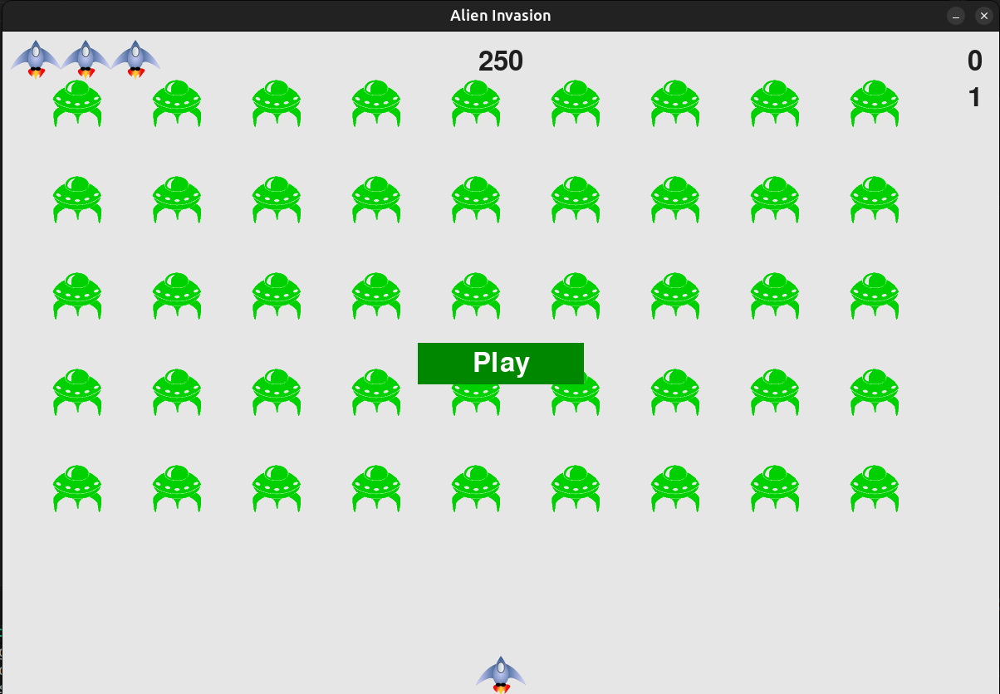

# Alien Invasion 🚀

**Alien Invasion** is a small 2D arcade-style game built with Python and Pygame. The player controls a ship, shoots aliens, and tries to get the highest score. This repository contains the game code and assets so you can run and modify the game locally.


---

## ▶️ Features

- Player-controlled ship with left/right movement
- Shoot bullets to destroy aliens
- Scoreboard and persistent high score (stored in `high_score.json`)
- Play button and simple game states (start/pause/game over)

---

## 🛠️ Requirements

- Python 3.8+ (or any Python 3.x)
- Pygame

---

## ⚡ Installation & Running

1. Clone the repo and change into the project folder:

```bash
git clone https://github.com/oksiguana/alien-invasion
cd alien-invasion
```

2. (Optional but recommended) Create and activate a virtual environment:

```bash
python3 -m venv .venv
source .venv/bin/activate
```

3. Install Pygame:

```bash
pip install pygame
```

4. Run the game:

```bash
python3 alien_invasion.py
```

---

## 🎮 Controls

- Left Arrow: Move ship left
- Right Arrow: Move ship right
- Space: Fire bullet
- Q: Quit game (high score is saved on exit)
- Click `Play` to start/restart the game

---

## 📁 Project Structure

- `alien_invasion.py` — main entry point
- `settings.py` — game configuration
- `ship.py`, `alien.py`, `bullet.py` — game entities
- `scoreboard.py`, `game_stats.py`, `button.py` — UI & game management
- `images/` — game assets (`alien.bmp`, `ship.bmp`)
- `high_score.json` — saved high score

---

## 💡 Notes

- The high score is saved to `high_score.json` when you quit the game.
- If you add new assets, keep them in the `images/` folder and reference them by filename.

---

## Credits

- This project is based on and adapted from *Python Crash Course — Third Edition* by Eric Matthes. The game structure and many concepts are derived from the examples and exercises in that book.

- Used for learning and practice; code here includes small modifications and enhancements made by the repository author.

---

Enjoy the game! 🚀
